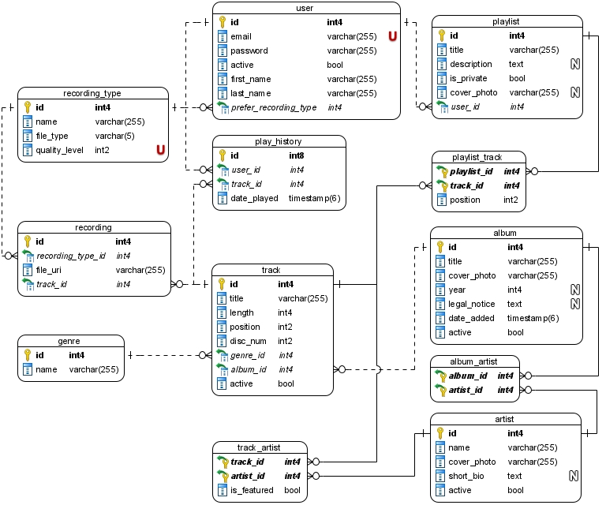

# Music Streamer DB

> **Note:** This is not a proper, production-ready database! It's sole purpose is to demonstrate some SQL performance optimization techniques in PostgreSQL.

## Introduction

Music Streamer DB is a database model for hypothetical music streaming service that suffers from performance issues when loaded with large quantities of data on a single machine.

### Model

.

DDL available [here](./ddl.sql).

### Sample data (not included)

* 1,612,297 artists
* 23,969,487 tracks
* 4 levels of quality (recording types)
  * 95,877,948 recordings
* 1,990,576 albums
* 1,001 user
* 1,040 playlists
* 5,214,584 records in play_history

### Runtime

Oracle VirtualBox virtual machine with 8GB of RAM and 2 CPUs, running Ubuntu linux 20.04.2 LTS and PostgreSQL 12.6.

PostgreSQL default configuration is updated with [these settings](./postgresql.conf).

## Performance optimization

Some random testing shows that performance of most of the queries is bad at best. Depending on the amount of buffered data in memory, some queries can last up to a minute. Imagine waiting for 48 seconds on Spotify to start playing a song :frowning: 

| Query            | Best time | Worst time | Optimization steps                                | New time |
| ---------------- | --------- | ---------- | ------------------------------------------------- | -------- |
| Get recording    | 4s        | 48s        | [Steps](./optimizations/1-get_recording/)         | 2-10ms   |
| Artist search    | 4.3s      | 21.2s      | [Steps](./optimizations/2-artist_search/)         | <100ms    |
| Track search     | 12.4s     | 31.6s      | [Steps](./optimizations/3-track_search/)          | 5-800ms* |
| Album search     | 4.8s      | 22.2s      | [Steps](./optimizations/4-album_search/)          | 5-150ms* |
| Playlist search  | 20ms      | 1s         | [Steps](./optimizations/5-playlist_search/)       | <3ms     |
| Recently played  | 275ms     | 44s        | [Steps](./optimizations/6-last10/)                | <10ms    |
| Popular artists  | 4s        | 54s        | [Steps](./optimizations/7-popular_artists_month/) | <3ms     |
| Favorite artists | 200ms     | 11s        | [Steps](./optimizations/8-favorite_artists/)      | <3ms     |

\* Due to large amount of data, some data cannot be obtained faster when located farther within the index, like rarely played songs for example.

### Doing work in the background

Moving complex trigger work into the background process is demonstrated [here](./optimizations/9-listener/), with a sample app written in C#.

## Licence

MIT